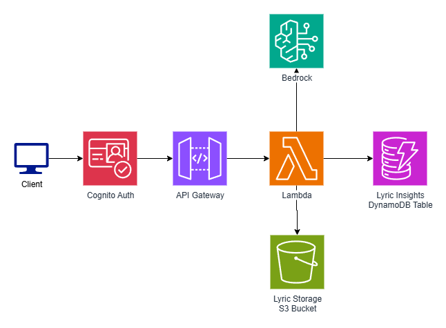

# BetterGenius Project Spec (Design-Only)

## 1) User & Decision

**Who will use this?**
* **Music fans** who want to better understand the meaning of lyrics
* **Artists** who want to engage with their audience and explain their songs
* **Community contributors** (like on Genius) who enjoy annotating and sharing interpretations
* **Casual listeners** who just want quick lyric access

**What decision does your prediction/design inform?**
* Your design helps decide **how users consume and interact with music knowledge**:
   * For listeners, it informs the decision of *whether to dive deeper into a song's meaning*
   * For artists, it informs *how to present context around their lyrics*
   * For contributors, it informs *what annotations or insights to add and how to collaborate*

## 2) Target & Horizon

**Target:** Confidence score (0-1) for each analytical insight generated about lyric meaning and themes

**Horizon:** Analysis complete within 2-3 minutes of lyric upload

## 3) Features (No Leakage)

**Available at prediction time:**
* Lyric text content (word patterns, sentiment, structure, literary devices)
* Artist metadata (personal life, genre, era, geography) 
* Cultural/historical context markers from release date
* Song metadata (album, collaborators, production details)
* Literary device patterns (metaphors, repetition, rhyme schemes)
* Language and regional dialect indicators

**Excluded to avoid leakage:**
* User feedback on interpretations
* Post-release cultural events or memes
* Streaming popularity data
* Future artist interviews explaining the song
* Community voting/rating on existing annotations

## 4) Baseline → Model Plan

**Baseline (can implement immediately):**
Rule-based system matching keywords to theme templates:
* Love/relationships: "heart", "forever", "you and I" → romance analysis
* Loss/sadness: "gone", "miss", "tears" → grief analysis  
* Rebellion: "fight", "free", "break" → protest analysis
* Simple sentiment scoring and template explanations for detected themes

**Model Plan:**
Transformer-based text classification model fine-tuned on lyric analysis tasks
* **Why it's better:** Can capture nuanced context, metaphorical language, and multi-layered meanings that keyword matching misses
* **Hypothesis:** Pre-trained language models understand literary devices and can identify thematic patterns across different musical genres and time periods

## 5) Metrics, SLA, and Cost

**Metrics:**
* **Primary:** User relevance rating >4.0/5.0 for generated interpretations
* **Secondary:** Theme classification accuracy (F1-score >0.75)
* **Coverage:** >80% of uploaded lyrics successfully analyzed

**Why these fit:**
* User rating directly measures value delivered to end users
* Classification accuracy ensures technical quality
* Coverage ensures system reliability across diverse music catalog

**SLA:**
* **p95 latency:** < 180 seconds for complete analysis
* **Cost envelope:** < $0.50 per analysis (including compute and API calls)

## 6) API Sketch

### 6.1 Endpoints

| Method | Path | Purpose | Auth? |
|--------|------|---------|-------|
| POST | /v1/analyze | Submit lyrics for analysis, return insights | Bearer |
| GET | /v1/analysis/{id} | Retrieve analysis results | Bearer |
| GET | /v1/health | Liveness check | None |
| GET | /v1/status/{id} | Check analysis progress | Bearer |

**Notes:** 
* Versioning: `/v1` for initial release
* Rate limits: 10 analyses per minute per user
* Idempotency: Use `Analysis-Id` header for duplicate prevention

### 6.2 Request/Response Examples

**Request (POST /v1/analyze):**
```json
{
  "lyrics": "Hello darkness, my old friend\nI've come to talk with you again...",
  "artist": "Simon & Garfunkel",
  "song_title": "The Sound of Silence",
  "release_year": 1964,
  "genre": "folk rock",
  "analysis_id": "uuid-12345"
}
```

**Response (202 - Analysis Started):**
```json
{
  "analysis_id": "uuid-12345",
  "status": "processing",
  "estimated_completion": "2024-09-19T15:03:00Z"
}
```

**Response (GET /v1/analysis/uuid-12345 - Complete):**
```json
{
  "analysis_id": "uuid-12345",
  "status": "complete",
  "insights": [
    {
      "theme": "isolation",
      "confidence": 0.92,
      "explanation": "The personification of darkness as a friend suggests profound loneliness...",
      "evidence": ["Hello darkness, my old friend", "talking to myself"]
    },
    {
      "theme": "social_commentary", 
      "confidence": 0.87,
      "explanation": "References to neon signs and subway walls indicate urban alienation...",
      "evidence": ["neon light", "subway walls"]
    }
  ],
  "processing_time_ms": 45000,
  "cost_cents": 23
}
```

**Error (422 - Invalid Payload):**
```json
{
  "error": "invalid_payload",
  "message": "Missing required field",
  "fields": ["lyrics"]
}
```

**Error (429 - Rate Limited):**
```json
{
  "error": "rate_limited", 
  "message": "Analysis limit exceeded",
  "retry_after": 60
}
```

### 6.3 Auth Scheme

**Authorization:** `Bearer <JWT_token>` in request header
* JWT tokens issued by AWS Cognito User Pool
* Token validation via Cognito public keys
* Rate limiting tied to Cognito user ID (`sub` claim)
* Required claims: `sub` (user ID), `email_verified`, `cognito:groups` (optional for role-based access)
* Token expiration: 1 hour (configurable in Cognito)
* Refresh tokens handled by client applications


## 7) Privacy/Ethics (PIA excerpt)

**Data inventory:** 
- Lyrics text, analysis results (user-controlled retention)
- User authentication tokens (account lifetime)
- Request/error logs: no user IDs, IPs, or personal data
- Usage aggregates: song popularity counts (k>100 only)

**Purpose:** Service delivery, system monitoring, capacity planning

**Retention:** 
- Raw API logs TTL ≤ 30 days
- Error logs ≤ 90 days  
- Usage aggregates 180 days
- User data: indefinite (user-controlled)

**Access:** Least-privilege; users access own data only; ops team time-limited log access

**Telemetry decision matrix:**

| Metric | Value | Invasiveness | Effort | Decision |
|--------|-------|--------------|--------|----------|
| Response times | High | None | Low | ✅ Keep |
| Error rates | High | None | Low | ✅ Keep |
| Popular songs (k>100) | Medium | Low | Low | ✅ Keep |
| User analysis frequency | Medium | Medium | Low | ❌ Drop |
| Individual song requests | Low | High | Low | ❌ Drop |
| User music taste profiling | Low | High | High | ❌ Drop |

**Reciprocity:** Users provide lyrics → receive AI interpretations + history. 80% user value, 20% collective improvement.

## 8) Architecture Diagram




## 9) Risks & Tests

**AI bias risk (cultural/genre misinterpretation):** acceptance test—user relevance rating ≥ 4.0/5.0 across 5+ musical genres, 3+ languages

**Analysis quality risk (hallucinated interpretations):** offline validation—confidence scores correlate with human expert ratings (r ≥ 0.6) on 100-song test set  

**Cost drift:** verify monthly Bedrock costs stay ≤ $0.50 per analysis under normal load; alert if 7-day rolling average exceeds threshold

## 10) Measurement Plan

**Baseline vs Model experiment:** A/B test keyword-matching baseline vs transformer model on 200 lyrics; measure user rating difference (target: +0.5 improvement, significance p<0.05)

**SLA measurement:**
- Latency: CloudWatch p95 timer from API request to analysis complete ≤ 180s
- Cost: DynamoDB + Bedrock + Lambda costs per analysis tracked via AWS Cost Explorer tags ≤ $0.50

### X.X Socratic Log
* Prompt A (design alternatives): 
    * Prompt - "I want to use AWS to create this project. Currently the architecture is API gateway to Lambda to bedrock to dynamodb to store generated explanations and the full lyrics. What are some alternatives to storage options?"
    * Output - "... Stick with DynamoDB for your current use case because: Perfect fit for simple key-value lookups (song_id → analysis)
Serverless and scales automatically with Lambda..."
* Prompt B (red-team): 
    * “Will the maximum document size for DDB be an issue?”
    * Output: "... Cons of Pure DynamoDB: 400KB item limit - Long songs might hit this (epic songs, opera, concept albums) ..."
* Inflection point: It is pointed out that documents in DDB have a maximum size of 400kb. If I wanted to store all types of songs, the full lyrics may not fit into a single document. Costs are also much higher than S3 so I will store the static lyric data there instead. 
* Outcome: Lyrics can now be uploaded and stored in S3 while analytics and meanings generated from these uploaded lyrics can still be stored in DDB. 